# TodoApp

Bu proje iki ayrı bölümden oluşmaktadır:

- **Backend**: ASP.NET Core Web API (MSSQL veritabanı ile çalışır)
- **Frontend**: React + Vite ile geliştirilmiştir

## Proje Yapısı

TodoApp/
│
├── TodoBackend/         --> ASP.NET Core API
│   └── WebApplication6/
│       └── WebApplication6.sln
│
├── TodoFrontend/        --> React (Vite)
│
├── Screenshots/         --> Uygulama ekran görüntüleri
│
└── README.md


## Kurulum ve Çalıştırma

### 1. Backend (ASP.NET Core API)

#### Gereksinimler
- [.NET 8 SDK](https://dotnet.microsoft.com/download)
- SQL Server

#### 🔧 Veritabanı Bağlantısı

`TodoBackend/WebApplication6/WebApplication6/appsettings.json` dosyasında aşağıdaki bağlantı dizesini kendi veritabanı ayarlarınıza göre güncelleyin:

```json
"ConnectionStrings": {
  "DefaultConnection": "Server=.;Database=TodoDb;Trusted_Connection=True;TrustServerCertificate=True;"
}
```
Örnek bağlantı dizileri:

* **Windows Authentication (local MSSQL)**
  `"Server=.;Database=TodoDb;Trusted_Connection=True;TrustServerCertificate=True;"`

* **SQL Authentication**
  `"Server=localhost;Database=TodoDb;User Id=sa;Password=your_password;TrustServerCertificate=True;"`


### 2. Frontend (React + Vite)

#### Gereksinimler

* [Node.js ve npm](https://nodejs.org/)

> Uygulama varsayılan olarak `http://localhost:5173` adresinde çalışacaktır.

### Frontend’i çalıştırmak için:

```bash
cd TodoFrontend
npm install
npm run dev
```

## Geliştirici Notları

* Backend ve frontend birbirinden tamamen bağımsız çalışır.
* Gerekirse backend üzerinde CORS ayarlarını düzenleyin (`Program.cs` içinde).

## Ekran Görüntüleri

### Giriş Ekranı
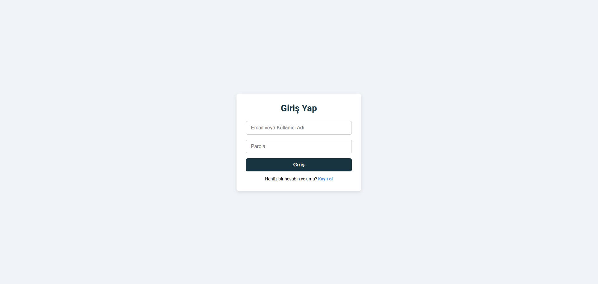

### Kayıt Ekranı
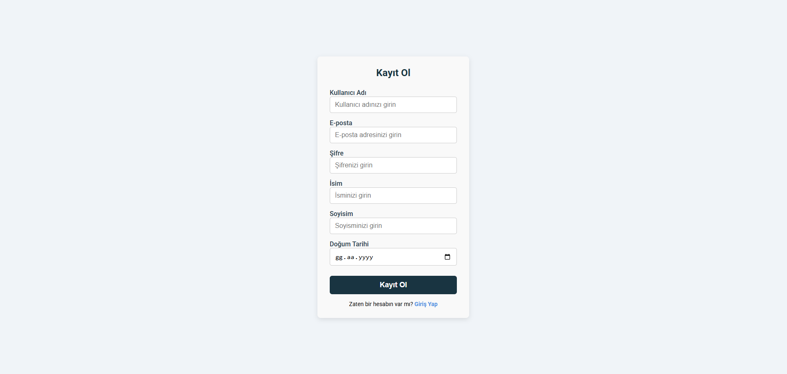

### Ana Sayfa (Görev Listesi)


### Board Ekleme
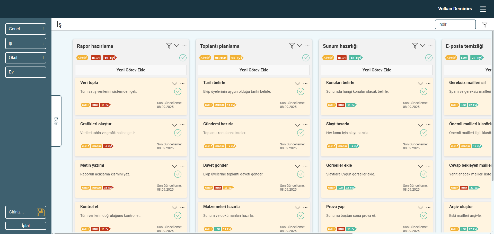

### Görev Ekleme
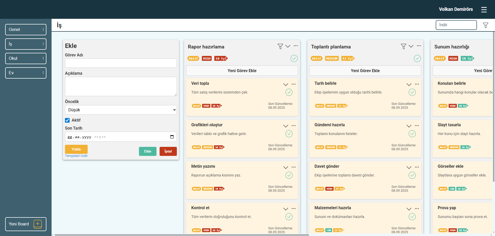

### Alt Görev Ekleme
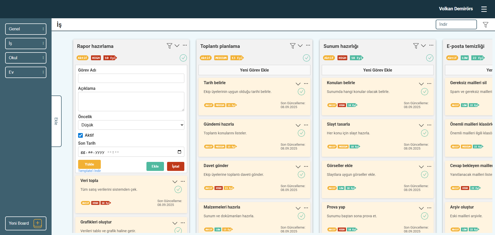

### Board Düzenleme
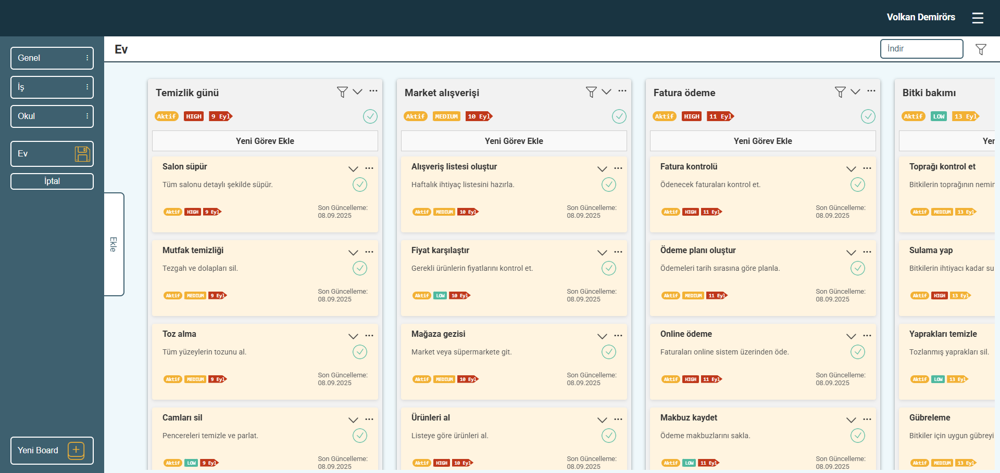

### Görev Düzenleme
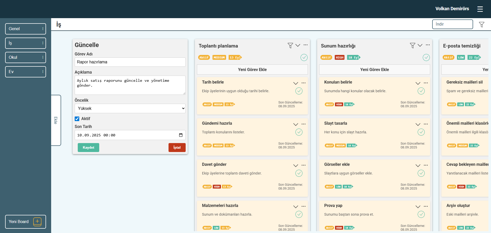

### Alt Görev Düzenleme
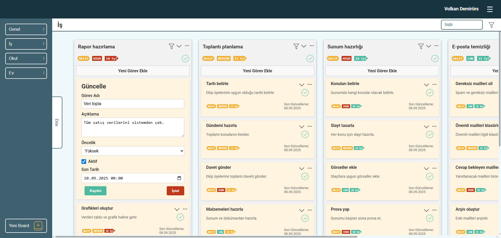

### Görev Filtre
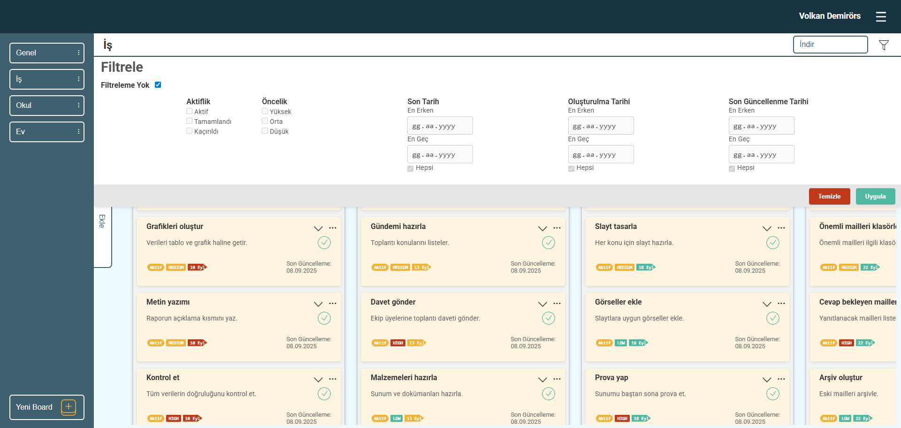

### Alt Görev Filtre
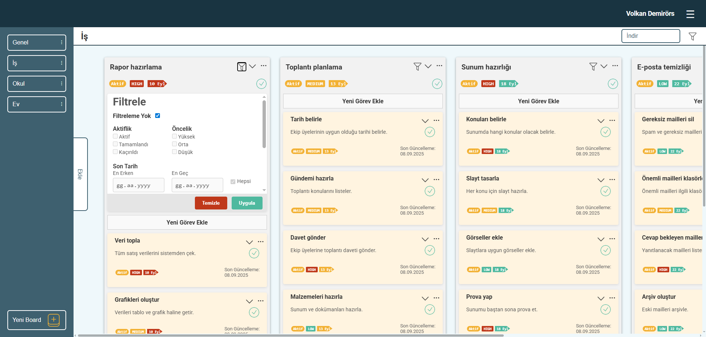

### Görev Detayları
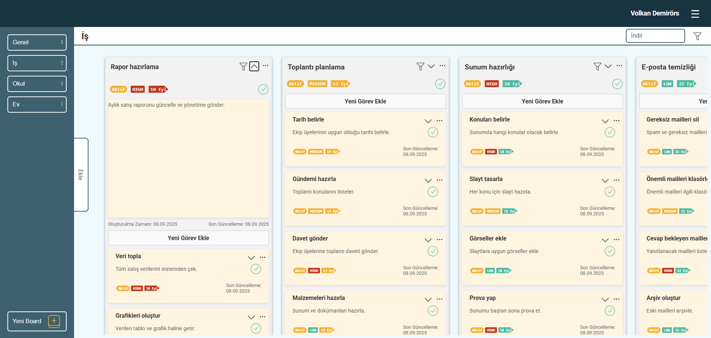

### Alt Görev Detayları
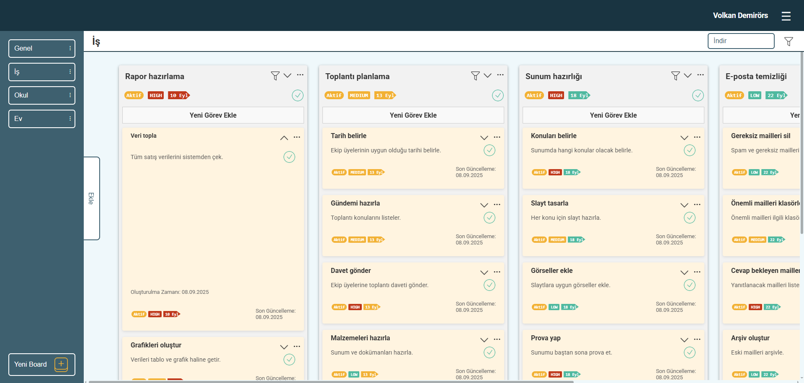


